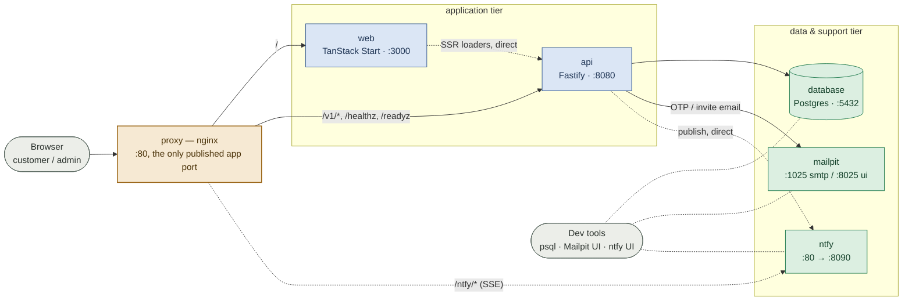
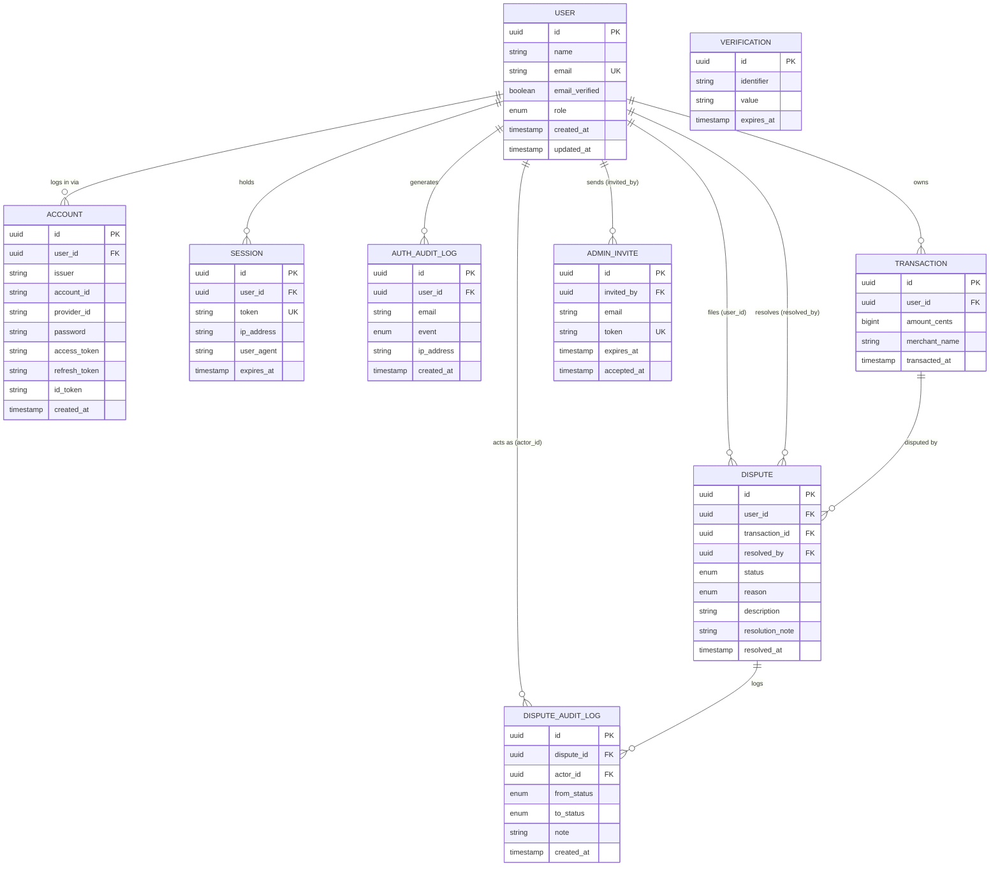

# Infrastructure

How the system connects end to end: container topology, data model, one real request/notification flow, and the target cloud/k8s shape beyond this repo. *Why*: `docs/progress-and-decisions.md` (numbers referenced inline). User-facing flows: `docs/user-stories.md`. Request-level backend behavior (stateless API, rate limiting, idempotency, health endpoints): `docs/backend-service.md`. Production deploy: `docs/production-runbook.md`.

## Container topology

`proxy` (nginx, `docs/progress-and-decisions.md` #61) is the only service publishing its app-facing port — `web` and `api` are `expose`-only, reachable exclusively through it. `database`, `mailpit`, and `ntfy` also publish their own ports directly, for dev tooling (`psql`, Mailpit UI, ntfy UI) only.



Two paths run through this topology twice, browser vs. server:

- **`web` → `api`.** Browser fetches go out to `http://dispute-portal` and back through the proxy (`VITE_API_URL`). `web`'s server (TanStack Start's SSR loaders, inside the `web` container) calls `api` directly over the compose network instead (`SERVER_API_URL=http://transaction-dispute-portal-api:8080`), bypassing the proxy.
- **`api` → `ntfy`.** `api` publishes dispute-status events straight to `ntfy` container-to-container (`NTFY_URL`), no proxy hop. The browser's SSE subscription goes through the proxy at `/ntfy/*` instead, since it only knows the one public origin (`docs/progress-and-decisions.md` #61). SSE needs `proxy_buffering off` and a long read timeout, so `/ntfy/` has its own `location` block in `nginx.conf`.

## Data model

Nine tables: four Better Auth's own (`user`, `account`, `session`, `verification`, plus `auth_audit_log` wrapping login events — `docs/progress-and-decisions.md` #21/#37), four the product's (`transaction`, `dispute`, `dispute_audit_log`, `admin_invite` — `docs/progress-and-decisions.md` #16/#40/#41). `dispute` has two FKs to `user`: filer (`user_id`) and closer (`resolved_by`, nullable until resolved).



`VERIFICATION` has no FK — Better Auth keys it by `identifier` (the OTP's target email), not `user_id`, since the account may not exist yet. Two constraints are partial unique indexes, not plain `UK` columns, both enforced in Postgres, not app code: `dispute` allows only one row per `transaction_id` while `status` is `SUBMITTED`/`UNDER_REVIEW` (`docs/progress-and-decisions.md` #40); `admin_invite` allows only one row per `email` while `accepted_at` is null.

## Request flow: submit → review → resolve → notify

One flow through the topology above, chosen for the parts that are easy to get wrong: the guarded writes (`docs/progress-and-decisions.md` #4/#41) and the publish-direct-but-subscribe-proxied split for `ntfy`.

```mermaid
sequenceDiagram
    participant C as Customer browser
    participant P as proxy (nginx)
    participant A as api (Fastify)
    participant D as database (Postgres)
    participant N as ntfy
    participant Ad as Admin browser

    Note over C,N: Customer's browser holds an open SSE connection to /ntfy/&lt;their-topic&gt; the whole time

    C->>P: POST /v1/disputes
    P->>A: forward
    A->>D: guarded INSERT<br/>(one open dispute per transaction, #40)
    D-->>A: 201, dispute SUBMITTED
    A-->>P: 201
    P-->>C: 201

    Ad->>P: POST /v1/admin/disputes/:id/review
    P->>A: forward
    A->>D: guarded UPDATE … WHERE status='SUBMITTED'
    D-->>A: UNDER_REVIEW
    A-->>P: 200
    P-->>Ad: 200
    A->>N: publish "under review" (direct, NTFY_URL)
    N--)P: SSE frame
    P--)C: SSE frame → toast

    Ad->>P: POST /v1/admin/disputes/:id/resolve
    P->>A: forward
    A->>D: guarded UPDATE … WHERE status='UNDER_REVIEW'
    D-->>A: RESOLVED
    A-->>P: 200
    P-->>Ad: 200
    A->>N: publish "resolved" (direct, NTFY_URL)
    N--)P: SSE frame
    P--)C: SSE frame → toast
```

The two `UPDATE … WHERE` steps are load-bearing: the "from" status sits in the `WHERE` clause, not a prior read, so a concurrent second call matches nothing and gets `409` instead of double-writing or double-publishing — verified under 5,000 simultaneous identical requests (this session's load-test artifact), not just the sequential case the integration suite covers.

## k8s manifests vs. documented-only targets

`k8s/` manifests are a planned, concrete deliverable, not just prose (`docs/progress-and-decisions.md` #10): `replicas: 3`, resource requests/limits, an HPA keyed on CPU, a PodDisruptionBudget — real enough to point to on screen, never actually deployed. Step-by-step for writing them: `docs/production-runbook.md` §8. Everything else below is target architecture, stated and justified, not built:

| Area | Target | Why |
| --- | --- | --- |
| Production DB | Managed Postgres (RDS/Aurora Multi-AZ or Azure equivalent) | Automated failover + backups; RTO/RPO tradeoff |
| Read replica | For the historic-disputes read path | Once write/read ratio justifies it — ties to the indexing story above |
| Load balancing | ALB/API Gateway → ECS/Fargate or k8s Ingress in front of the stateless API | Meaningful only *because* the API is stateless; also the stable domain the frontend is built against, so infra can move behind it without invalidating an already-built client bundle (`docs/production-runbook.md` §3) |
| Event durability | Move the status-change event to SQS/EventBridge | Today it's in-process/simulated; production shouldn't let a notification-consumer failure touch the API request path |
| Session-lookup cost | Short-TTL cache on the session read, or Better Auth's cookie-cache/JWT session mode | The load test (`docs/progress-and-decisions.md`'s Progress section) shows the DB-backed session check, not Postgres or Fastify, is the authenticated-route ceiling — mitigate the read, don't move state back into the process |

README's cloud/k8s mention: one short paragraph, AWS target (ECS/Fargate + RDS), no live infra required.
