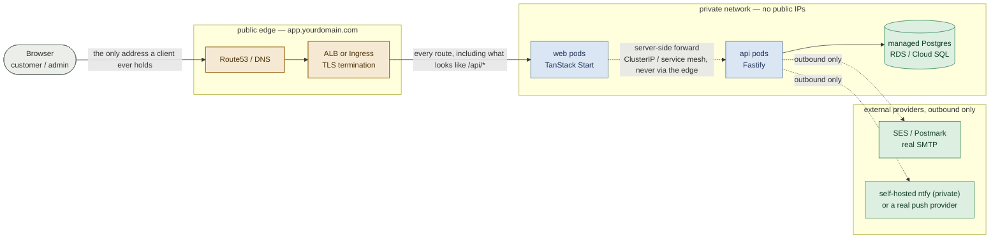

# Production runbook

This repo is **development-only**. A fresh clone runs one command:

```sh
docker compose up -d          # Postgres, api, web, Mailpit, ntfy, an nginx reverse proxy; migrations run on api start
docker compose exec transaction-dispute-portal-api \
  pnpm --filter @transaction-dispute-portal/api db:seed   # once, for demo data
```

There is one `compose.yml`, one `Dockerfile` per package (a dev image: full workspace, `tsx`/`vite` watch, source bind-mounted), one committed `.env` per package plus `env/development/.env.database`. No live deployment, no staging, no production images are built anywhere.

Deliberate scope choice (`docs/progress-and-decisions.md` #34, and the earlier #24–#27/#32–#33 that built — then this pass removed — a staging pipeline). This document answers *"and how would you actually ship this?"*: nothing here is wired, each section is what you'd add.

---

## 1. Build a real runtime image

The dev `Dockerfile` installs devDependencies and runs the TypeScript source through `tsx`. A production image should be multi-stage and ship only compiled output:

```dockerfile
# deps  — full workspace install (dev + prod) so the build can run
# build — pnpm --filter @transaction-dispute-portal/api... build   (tsc -> dist/)
# prod  — pnpm install --frozen-lockfile --prod   (no dev deps)
# runtime — FROM node:24-alpine, USER node, NODE_ENV=production
#   COPY --from=prod  node_modules (root + api + shared)
#   COPY --from=build api/dist shared/dist
#   COPY --from=build api/src/database/migrations   (static SQL, needed by the migrate runner)
#   CMD ["node", "dist/app.js"]
```

Notes carried over from when this existed:

- `shared/dist` loads `zod` at module-eval time and the api runtime imports `shared`, so `shared/node_modules` must ship in the runtime stage too, not just `api/node_modules`.
- The web SSR build externalises `react`/`react-dom` rather than bundling them, so the web runtime stage still needs `node_modules` alongside `dist/`.
- `drizzle-kit` stays a devDependency, never ships; the runtime uses the standalone `src/database/migrate.ts` runner (`node dist/database/migrate.js`).

Compiled artifact over `tsx` on source buys the fail-fast `tsc` gate in CI, a smaller attack surface, fast cold starts, a deterministic artifact.

## 2. Configuration and secrets

Committed env files hold **working local-only fakes** (`docs/progress-and-decisions.md` #34): a throwaway Postgres password, freshly-generated `BETTER_AUTH_SECRET` / `COOKIE_SECRET`, `SMTP_*` pointed at Mailpit, `NTFY_URL=http://ntfy`.

A real deployment:

- injects every value from the orchestrator's secret store (Kubernetes `Secret`, cloud secret manager) — **no `.env` file in the image or the repo**;
- generates fresh `BETTER_AUTH_SECRET` and `COOKIE_SECRET` (32+ bytes each) per environment;
- sets `NODE_ENV=production`, real `API_URL` / `FRONTEND_URL` / `CORS_ORIGIN`;
- keeps a real Gmail App Password (or SES/Postmark credentials) out of git — locally that already goes in an untracked `api/.env.local` (`docs/requirements.md`), in production it is an orchestrator secret.

## 3. Networking: a stable public API URL, not a raw infra address

`VITE_API_URL` is a Vite **build-time** var — inlined as a literal string into the client JS bundle, shipped to every browser. `SERVER_API_URL` is read from `process.env` at request time (SSR, Node-only), so it updates on the next server restart with no client involved. The risk is entirely on the `VITE_*` side: if it points at a raw infra address (an ALB's auto-generated DNS name, an ECS task IP) that changes when compute moves, every already-built bundle — including one open in a customer's browser right now — has that address hardcoded and starts failing the moment the old address stops resolving, with no way to fix it short of a fresh build.

**Mitigation: `VITE_API_URL` points at one owned domain behind a reverse proxy / load balancer, never at infrastructure directly.**

| Shape | Indirection | Result |
| --- | --- | --- |
| AWS | Route53 `api.<yourdomain>` → ALB (+ optional CloudFront) → target group → whatever's serving traffic (ECS service, EKS Ingress, EC2 ASG) | Migrating infra (new region, ECS → EKS, new account) just repoints the target group; the built-in URL never changes, no rebuild, no customer-visible break |
| Kubernetes (§8) | `Ingress` is the reverse proxy: `api.<yourdomain>` → `Ingress` → `Service` → live `Deployment` pods | Swapping deployments behind a `Service` is invisible above the `Ingress` |
| This dev stack, today | nginx (`docs/progress-and-decisions.md` #61, `proxy/nginx.conf`) in front of `web`/`api`/`ntfy`; only the proxy publishes `:80` | A one-file toy version of the same proof, live: build against one address, swap what's behind it freely |

Same reasoning applies to every other client-facing URL — `FRONTEND_URL` / `CORS_ORIGIN` (§2), `NTFY_URL` (§6) — resolve through an owned domain, never a cloud-generated hostname.

**Production goes one step further than the dev stack: `api` isn't reachable from the internet at all.** The dev nginx (#61) is infra-level path routing — one address for both, but a browser request for `/v1/disputes` still terminates at the `api` container; nginx just fronts two independently-reachable services. That's enough to prove the one-stable-address claim, but `api` is still a public endpoint. Production closes that: the client holds exactly one address, and everything but `web` sits in a private network with no public IP.



Concretely: `web`'s server gains `/api/*` routes forwarding to `api` over the internal network (`SERVER_API_URL` — the same mechanism SSR loaders already use, extended to cover browser calls too). `VITE_API_URL` becomes a same-origin relative path (`/api`) — nothing bakeable that could go stale — and `api` drops out of the `Ingress`/`ALB` routing table, reachable only inside the cluster. §8's `Ingress`/`Service` shape still applies; `api`'s `Service` is just `ClusterIP`-only, never attached to the `Ingress`.

A real architectural decision, not a tweak: it flips the CORS/cookie model (`docs/progress-and-decisions.md` #51's `withCredentials` + explicit `CORS_ORIGIN` becomes same-origin, cookies can go `SameSite=Strict`, `web`'s forwarding layer relays the session cookie on every proxied call) — worth its own decision entry if actually pursued, not built here.

## 4. Database

- Managed Postgres (RDS / Cloud SQL), not a container. Point `DATABASE_URL` at it.
- Connection pooling: the app opens one pool per instance; put PgBouncer (or the provider's proxy) in front once instance count grows.
- Backups + PITR enabled on the managed instance.

### Migrations as their own gated step

Do **not** run migrations from the app's start command in production (the dev `compose.yml` only does this because it's safe to re-run against a disposable database). A schema change is a reviewed, approved step, independent of the code rollout (`docs/progress-and-decisions.md` #24).

The shape that existed before (`.github/workflows/migrate.yml`, removed in `docs/progress-and-decisions.md` #42): `workflow_dispatch` → `drizzle-kit check` (snapshot/drift guard, no DB needed) → fail if the environment's `DATABASE_URL` secret is missing → `pnpm --filter @transaction-dispute-portal/api migrate`. `concurrency` with `cancel-in-progress: false` so two runs never touch one database at once.

## 5. Email (SMTP) — on the login-critical path

Login is email-OTP (`docs/progress-and-decisions.md` #21, `docs/backend-service.md` §2): every sign-in sends a code over SMTP, so outbound email is a hard dependency, not best-effort.

- Real transactional provider (SES, Postmark, SendGrid), authenticated domain (SPF/DKIM/DMARC).
- `sendEmail` currently swallows transport errors (`docs/progress-and-decisions.md` #31) — in production, surface them: alert on send-failure rate, and consider a fallback provider.
- Rate-limit knobs are `RATE_LIMIT_MAX` / `RATE_LIMIT_WINDOW` (global) and `OTP.MAX_ATTEMPTS` (per-OTP, shared constant); the auth routes inherit the global window.

## 6. Notifications (ntfy)

Dispute-status changes publish to a per-user ntfy topic (`docs/dev-tools.md`). This is explicitly a *simulated* notification channel — not real push/SMS.

- Dev: the `ntfy` service in `compose.yml`, web UI on `localhost:8090`.
- Production: either run a self-hosted ntfy instance and set `NTFY_URL` to it, or accept that this stays a demo affordance. It must never carry auth credentials (OTP codes) — see the scope boundary in `docs/dev-tools.md`.

## 7. CI/CD

Current CI (`.github/workflows/build.yml`): lint / typecheck / build / test, plus a `docker compose up --wait` smoke test that seeds and hits `/healthz`.

To deploy, add a workflow that on `main`:

1. reuses the check job (`workflow_call`), then
2. builds the multi-stage `api` / `web` images and pushes them to a registry (GHCR: `ghcr.io/<owner>/transaction-dispute-portal-{api,web}`), tagged `sha-<commit>` and `latest`;
3. deploys — `kubectl apply` / Helm / Argo — into an environment protected by GitHub **Environments** required-reviewers (configured in repo Settings → Environments, not expressible in YAML — `docs/progress-and-decisions.md` #25).

Build tags explicitly from `github.sha` / `github.ref_name`, not `docker/metadata-action` (`docs/progress-and-decisions.md` #25). Keep migrations (§4) a separate manually-approved workflow, not a step here.

## 8. Kubernetes

`k8s/` manifests are not in the repo yet (CLAUDE.md lists them as a bonus). A minimal set:

- `Deployment` for api and web, `Service` each, `Ingress` with TLS.
- Probes wired to the endpoints that exist for exactly this: `livenessProbe` → `GET /healthz`, `readinessProbe` → `GET /readyz` (the latter does a 2s `select 1`, so it fails the pod out of rotation when the DB is unreachable — `docs/backend-service.md`).
- `HorizontalPodAutoscaler` on CPU / RPS.
- Secrets from a `Secret` (or External Secrets Operator), config from a `ConfigMap`.
- A one-shot `Job` (or Argo pre-sync hook) for the migration step.

## 9. Observability and the load-test number

- Logs: structured JSON (Pino) to stdout, shipped by the platform. The `correlationId` (from `x-correlation-id` / `x-request-id`, echoed on every response) is the request-tracing key.
- Metrics: add a `/metrics` endpoint (prom-client) — request rate, p50/p95/p99 latency, error rate, pool saturation.
- The DoD asks for one load-test number (p95 / RPS) in the README: run `k6` / `autocannon` against `GET /v1/transactions` on the seeded dataset (~4.6k rows, pagination + indexes exercised) and record it.

## 10. Pre-ship checklist

- [ ] Multi-stage images build and run (`node dist/app.js`), non-root, no dev deps / source
- [ ] All secrets injected by the orchestrator; none in the image or git
- [ ] Fresh `BETTER_AUTH_SECRET` / `COOKIE_SECRET` per environment
- [ ] Managed Postgres with backups; `DATABASE_URL` points at it; pooling in front if multi-instance
- [ ] Migration workflow run and green before the app rollout
- [ ] Real SMTP with an authenticated domain; send-failure alerting
- [ ] Probes green (`/healthz`, `/readyz`), HPA configured
- [ ] Logs + metrics flowing; load-test number captured
